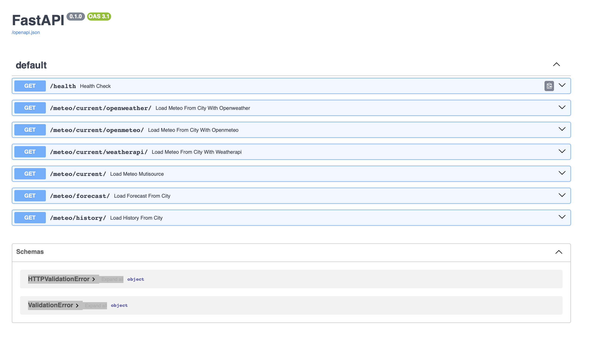
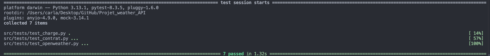
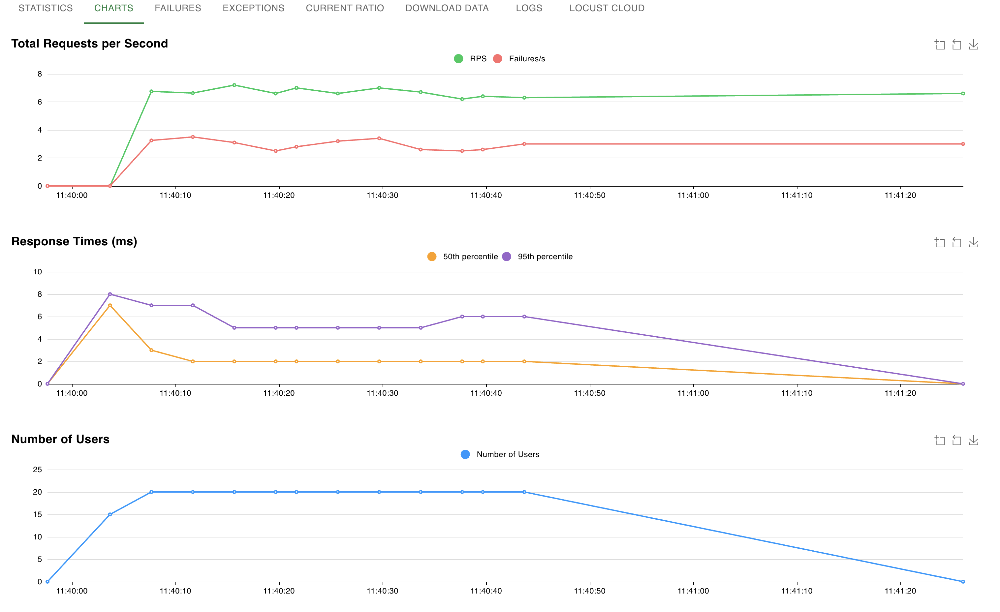

# README

## 0. Description

Le code source de l'API (FastApi python) se trouve dans le script : `src/services/api_fastapi/main.py`
Cette API expose les informations météorologiques actuelles à partir du nom de la ville reseignée. 
Les sources de données utilisées sont :
- openweather : `https://openweathermap.org`
    - géogoding pour les coordonnées (latitude, longitude)
    - informations météorologiques (pas fonctionnel)
- weather-api : `https://www.weatherapi.com`
- openmeteo : `https://open-meteo.com`

La route principale à interroger pour avoir les information météorologique aggrégées est : `/meteo/current/?city_name={city_name}`
Exemple : `/meteo/current/?city_name=Paris`
Routes swagger: 


## 🇫🇷 Lancer le projet

### 1. Lancer les services nécessaires avec Docker Compose

La commande suivante lancera le serveur redis. 

```bash
docker-compose up --build -d
```

### 2. Lancer l'API en local (hors Docker)

Ajouter les variables suivantes dans un fichier .env à la racine du projet :
```bash
api_key_open_weather = "your api key"
api_key_weather_api = "your api key"
redis_host = "localhost"
redis_port = "6379"
redis_db= "0"
fastapi_port = "8025"
fastapi_host = "localhost"
```

Assurez-vous d'avoir installé les dépendances :

```bash
pip install -r requirements.txt
```

Puis lancez l'API depuis la racine du projet:

```bash
python src/services/api_fastapi/main.py
```
L'API sera accessible sur `http://localhost:8025` *(si vous ne modifiez pas les ports d'exposition)*

### 3. Lancer les tests

Redis n'est pas obligatoire pour lancer les tests. Au moment de l'appel de l'api, le client redis ne sera simplement pas instancié et le code s'exécutera normalement en appelant les sources de données. Mais pour les tests de charge, si on veut garder un temps de réponse faible, il serait plus appréciable (< 500ms) de lancer le serveur redis avant la session de test.

#### Avec Pytest 

La commande suivante lance les tests unitaires sur les fonctions et des tests de contrat (validation des formats de réponse attendus)

```bash
pytest
```
Exemple resultats tests:


#### Avec Locust (tests de charge)

Le test de charge nécéssite que l'API soit démarré (au moins en localhost). Une fois l'API lancé, depuis la racine du projet exécuter la commande suivante pour démarrer les tests de charge. 

- `--users` : est le nombre d'utilisateurs simulés simultanément (ex: 20).
- `--spawn-rate` : est le nombre d'utilisateurs ajoutés par seconde (ex: 5 pour dire de 0 à 20 par bon de 5 chaque seconde).
- `--run-time` : durée totale du test (ex: 10m pour 10 minutes).
- `--headless` : exécute Locust sans interface web, en mode console.
- `--host` : URL de l'API cible à tester (ex: http://localhost:8025).

```bash
locust -f src/tests/load/locustfile.py --users 20 --spawn-rate 5 --run-time 10m --headless --host=http://localhost:8025
```
- Locust génère un tableau de rapport dans le CLI durant la session de test et à la fin un tableau récapitulatif.

- Pour avoir l'interface web, ne pas mettre le flag `--headless`. L'interface Locust sera disponible à l'adresse `http://127.0.0.1:8089` durant toute la session du test ; ceci permettra de suivre les temps de réponse et les taux de succès/echecs via des graphes en temps réeel.

Exemple : Test de charge de 20 utilisateurs en 1 minute avec `spawn-rate=5`.


---

## 🇬🇧 Launch the project

### 1. Launch with Docker Compose

```bash
docker-compose up --build
```

The API will be available at `http://localhost:8000`.

### 2. Run the API locally (without Docker)

Make sure dependencies are installed:

```bash
pip install -r requirements.txt
```

Then start the API:

```bash
uvicorn main:app --reload
```

### 3. Run tests

#### With Pytest

```bash
pytest
```

#### With Locust (load testing)

```bash
locust -f locustfile.py
```